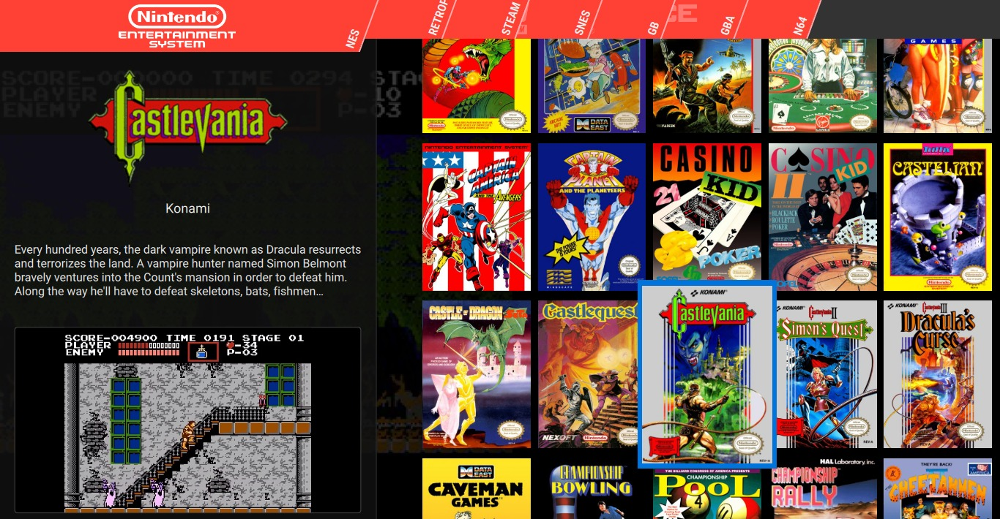

[CircleCI Badge]: https://circleci.com/gh/mmatyas/pegasus-frontend.svg?style=shield
[AppVeyor Badge]: https://ci.appveyor.com/api/projects/status/github/mmatyas/pegasus-frontend?svg=true&branch=master
[Coverity Badge]: https://scan.coverity.com/projects/12638/badge.svg
[Codacy Badge]: https://api.codacy.com/project/badge/Grade/716566e918a64b0fb20959c02779bbd2

[CircleCI Link]: https://circleci.com/gh/mmatyas/pegasus-frontend
[AppVeyor Link]: https://ci.appveyor.com/project/mmatyas/pegasus-frontend
[Coverity Link]: https://scan.coverity.com/projects/mmatyas-pegasus-frontend
[Codacy Link]: https://www.codacy.com/app/mmatyas/pegasus-frontend?utm_source=github.com&amp;utm_medium=referral&amp;utm_content=mmatyas/pegasus-frontend&amp;utm_campaign=Badge_Grade

[GPLv3]: https://img.shields.io/badge/license-GPLv3-blue.svg
[License]: LICENSE.md

[Website]: http://pegasus-frontend.org
[Documentation]: https://pegasus-frontend.org/docs/
[Releases]: https://github.com/mmatyas/pegasus-frontend/releases/
[Developer Forum]: https://retropie.org.uk/forum/topic/9598/announcing-pegasus-frontend

[Downloads]: https://pegasus-frontend.org/#downloads
[Getting Started]: http://pegasus-frontend.org/docs/user-guide/getting-started/

[Shaders]: etc/promo/shader_demo.jpg
[Build Guide]: http://pegasus-frontend.org/docs/dev/build

[PayPal Badge]: https://www.paypalobjects.com/webstatic/en_US/i/buttons/PP_logo_h_100x26.png
[Liberapay Badge]: https://liberapay.com/assets/widgets/donate.svg
[Patreon Badge]: etc/promo/donate-patreon.png
[Buy Me a Coffee Badge]: etc/promo/donate-coffee.png

[PayPal Link]: https://paypal.me/MatyasMustoha
[Liberapay Link]: https://liberapay.com/mmatyas/donate
[Patreon Link]: https://www.patreon.com/user?u=14424256
[Buy Me a Coffee Link]: https://www.buymeacoffee.com/mmatyas

<!----------------------------------------------------------------------------->





# Pegasus Frontend

**Pegasus** is a `highly customizable`, `cross-platform`, <br>
game launcher that allows you to *browse your titles* and <br>
*start your emulators* in one place.

---

[![CircleCI Badge]][CircleCI Link] 
[![AppVeyor Badge]][AppVeyor Link] 
[![Coverity Badge]][Coverity Link] 
[![GPLv3]][License]

<!-- [![Codacy Badge]][Codacy Link] Uncomment Once Functional -->

---

**⸢ [Website] ⸥ ⸢ [Releases] ⸥ ⸢ [Documentation] ⸥ ⸢ [Developer Forum] ⸥**

---

## Features

- **Hardware Accelerated**
- Works without `X11`

#### Cross Platform

- Windows
- Linux
- Mac
- Android
- Raspberries
- Odroids
- Similar systems

#### UI Control

- **Themes** cover everything
- **+ / -** `UI Elements`, `Menus`, `Animations`, ..
- Custom **[Shaders]** can be integrated

#### Quality Of Life

- **Gamepad** support / config
- Adjustable **Aspect Ratio**
- **Portable** support
- Automatic **Theme** reloading
- **Time** display

#### ES2 Backwards Compatible

Support for **EmulationStation** gamelist files.

---

## Installation

**⸢ [Downloads] ⸥ ⸢ [Getting Started] ⸥ ⸢ [Documentation / Configuration Guide][Documentation] ⸥**

---

## Building

Check out the **[Build Guide]**.

<br>

#### Dependencies

- `C++ 11` Compatible Compiler

- `SDL 2.04+` or `Qt Gamepad`

- `Qt 5.15.0+` + Modules:
    - `QML` & `QtQuick2`
    - `SQL (SQLite v3)`
    - `Multimedia`
    - `SVG`

<br>

#### Downloading The Source

This project uses `Git Submodules`, if you have cloned this <br>
repository **recursively**, they will already have been downloaded.

If you haven't or *updated your repo*, use this:

```sh
git submodule update --init
```

<br>

#### Building

You can use any Qt-compatible **IDE**s, such as <br>
`Qt Creator` to build or manually invoke:

```sh
mkdir build && cd build

# qmake [params] [project path], see below
qmake ..        
make

# optional, to run tests
make check

# optional
make install  
```

*Check out the* ***[Build Guide]*** *for more details / build parameters.*

---

## Donate

Pegasus is a **free** and **open source** project, and *will remain as one*.

If you would like to provide financial support, you can use the following links.<br> This is completely optional, but ***every contribution is much appreciated!***

[![PayPal Badge]][PayPal Link] 
[![Liberapay Badge]][Liberapay Link] 
[![Patreon Badge]][Patreon Link] 
[![Buy Me a Coffee Badge]][Buy Me a Coffee Link]

---

## License

Pegasus Frontend is available under **GPLv3** license.

Some included *assets*, such as *product logos* and *symbols* may not <br>
be available for commercial usage and / or may require additional <br>
permissions from their respective owners for certain legal uses.

Furthermore, trademark usage may be limited as per §7 of the **GPLv3** license.<br> You can find the details in the **[License]** file.

All trademarks, service marks, trade names, trade dress, product names <br>
and logos are property of their respective owners. All company, product <br>
and service names used in this product are for identification purposes only. <br>
Use of these names, logos, and brands does not imply endorsement.
