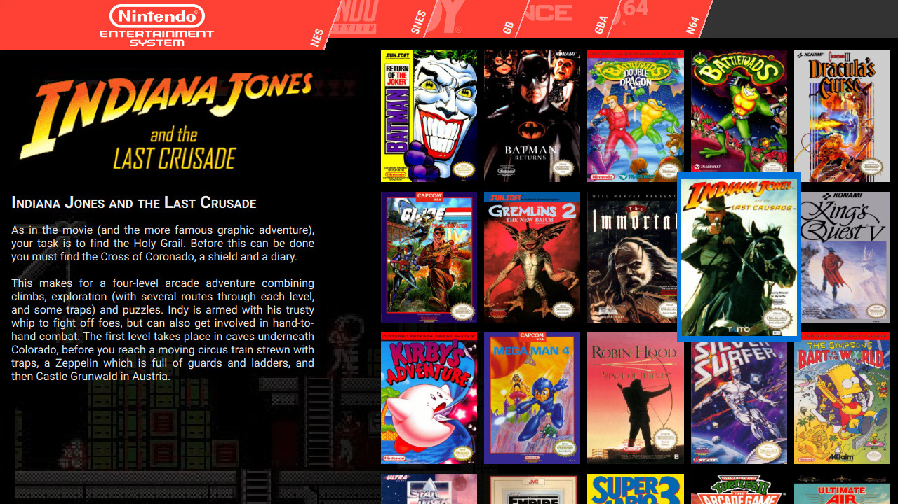

# Pegasus Frontend

A cross platform, customizable graphical frontend for launching emulators and managing your game collection.

[](https://travis-ci.org/mmatyas/pegasus-frontend)
[](https://ci.appveyor.com/project/mmatyas/pegasus-frontend)
[](https://scan.coverity.com/projects/mmatyas-pegasus-frontend)
[](https://www.codacy.com/app/mmatyas/pegasus-frontend?utm_source=github.com&amp;utm_medium=referral&amp;utm_content=mmatyas/pegasus-frontend&amp;utm_campaign=Badge_Grade)
[](LICENSE.md)

- [Development thread](https://retropie.org.uk/forum/topic/9598/announcing-pegasus-frontend)
- [Latest automatic builds for Linux (incl. Raspberry Pi)][gh ci builds]
- [Latest automatic build for Windows][appveyor mingw build]

## Features

**Open source and cross platform:** runs on Linux, Windows, Mac, all Raspberries, Odroids and possibly on other devices. Hardware accelerated and works with or without X11. It may even run on phones and tablets too.

**Full control over the UI:** you can completely change everything that is on the screen, add or remove UI elements, menu screens, whatever. Want to make it look like Kodi? Steam? Any other launcher? No problem. You can even [run your custom shader code](etc/promo/shader_demo.jpg).

**ES2 backward compatibility:** Pegasus can use EmulationStation's gamelist files, no need to invent a new set of tools.

**Features you'd expect:** Gamepad support and config. Multiple aspect ratio support. Portable mode support. Live theme reload. Visible system informations. A clock in the corner.


## Installation

At the moment, this project is still in alpha. You can find the current unstable releases and the latest automatic builds [here][gh ci builds] (for Linux) or [here][appveyor mingw build] (for Windows). You can also build the program manually from its source code.

### Runtime dependencies

While the releases try to include most required dependencies, on some platforms you might need to install additional packages.

- Linux: a distro not older than Ubuntu 14.04 or Debian Wheezy is recommended. The dependencies are Fontconfig and GStreamer 1.x (`fontconfig gstreamer1.0-alsa gstreamer1.0-libav gstreamer1.0-plugins-good`).
- Windows: all dependencies included, should work on anything between Windows 7 and 10.

### Building from source

**Build dependencies**

- C++11 compatible compiler
- Qt 5.7 or later (5.9 recommended), with the following modules:
    - QML and QtQuick2
    - Multimedia
    - SVG
    - Gamepad

For more information, please see the detailed [build guide](https://github.com/mmatyas/pegasus-frontend/wiki/Building).

**Downloading the source**

The project uses Git submodules. If you cloned the repository recursively, they are automatically cloned as well. If you did not, you can do it manually like this:

```sh
# call this after every repo update
git submodule update --init
```

**Building**

You can use any Qt-compatible IDEs, eg. Qt Creator to build the project, or you can manually invoke

```sh
mkdir build && cd build
qmake ..  # qmake [params] [project path], see below
make
make install  # optional
```

**QMake parameters**

Additional parameters are available for QMake:

- `INSTALLDIR`: where to `make install` the program. Defaults to `/opt/pegasus-frontend` or `C:\pegasus-frontend`.

**For more details**, see the [wiki page](https://github.com/mmatyas/pegasus-frontend/wiki/Building).


## License

Pegasus Frontend is available under GPLv3 license. You can find the details in the [LICENSE](LICENSE.md) file.

All trademarks, service marks, trade names, trade dress, product names and logos are property of their respective owners. All company, product and service names used in this product are for identification purposes only. Use of these names, logos, and brands does not imply endorsement.


[gh ci builds]: https://github.com/mmatyas/pegasus-frontend/releases/tag/continuous
[appveyor mingw build]: https://ci.appveyor.com/api/projects/mmatyas/pegasus-frontend/artifacts/build/pegasus_ci.zip?job=Environment%3A%20flavor%3Dmingw%2C%20QTDIR%3DC%3A%5CQt%5C5.9%5Cmingw53_32
